# Аэродинамика паруса

Семинар Натальи Митропольской для яхт-клуба [Equipage](https://equipage.club), 16.03.2026

Видео: [youtu.be/MXJhzNGrsMo](https://youtu.be/MXJhzNGrsMo)

## Содержание

[О лекторе](#о-лекторе)
[Предварительные замечания](#предварительные-замечания)
[1. Аэродинамическая сила](#1-аэродинамическая-сила)
[2. Параметры потока и тела обтекания](#2-параметры-потока-и-тела-обтекания)
[3. Компоненты аэродинамической силы](#3-компоненты-аэродинамической-силы)
[4. Методы определения аэродинамической силы](#4-методы-определения-аэродинамической-силы)
[5. Уравнения Навье–Стокса](#5-уравнения-навьестокса)
[6. Теория циркуляции, теорема Кутты–Жуковского](#6-теория-циркуляции-теорема-куттыжуковского)
[7. Закон Бернулли](#7-закон-бернулли)
[8. Объяснения «феномена подъёмной силы»](#8-объяснения-феномена-подъёмной-силы)
[9. Испытания в аэродинамических трубах](#9-испытания-в-аэродинамических-трубах)
[10. Аэродинамические коэффициенты профиля](#10-аэродинамические-коэффициенты-профиля)
[11. Поляра лодки по VPP](#11-поляра-лодки-по-vpp)
[12. Коэффициенты давления](#12-коэффициенты-давления)
[13. Линии течения](#13-линии-течения)
[14. Поля давления и скоростей](#14-поля-давления-и-скоростей)
[15. Ламинарный и турбулентный потоки](#15-ламинарный-и-турбулентный-потоки)
[16. Пограничный слой](#16-пограничный-слой)
[17. Отрыв пограничного слоя](#17-отрыв-пограничного-слоя)
[Вопросы и ответы](#вопросы-и-ответы)
[Словарь](#словарь)
[Литература](#литература)

## О лекторе

[↑ Содержание](#содержание)

Наталья Митропольская — инженер, работала в компании Boeing (не аэродинамиком, а в области механики твёрдого тела). Последние 15 лет не принимала непосредственного участия в аэродинамических проектах, но вовлечённость в предмет комплексная, в том числе связанная с работой. Сейчас работает консультантом и консультирует производителей самолётов. Также — яхтсменка-гонщица.

### Мотивация семинара

Коллеги попросили Наталью порекомендовать материалы по аэродинамике для яхтсменов. Она просмотрела около 50 источников на разных языках и была разочарована: как минимум половина до сих пор объясняла подъёмную силу через равное время обтекания и закон Бернулли, либо утверждала, что воздух физически вращается вокруг паруса из-за циркуляции, либо что давление — вектор. Главной проблемой были даже не отдельные ошибки, а отсутствие контекста: все теории были перемешаны без объяснения того, как они связаны друг с другом и где каждая из них применима.

## Предварительные замечания

[↑ Содержание](#содержание)

- Рассматриваем только силы на парусе

- Только 2D-случай

- Крыло = парус (различия не делаются)

- Жидкость (fluid) = жидкость или газ, не liquid

## 1. Аэродинамическая сила

[↑ Содержание](#содержание)

Аэродинамическая сила действует на любое тело, помещённое в поток, подчиняясь фундаментальным законам сохранения:

- сохранения массы

- сохранения импульса

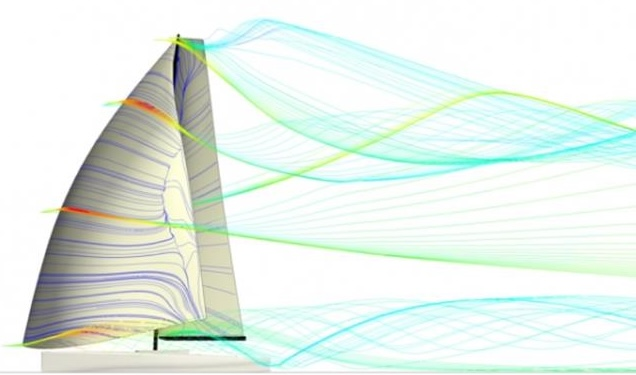

*CFD-визуализация обтекания яхты*

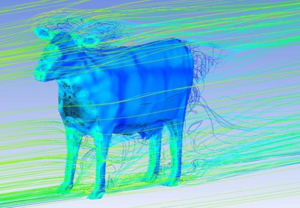

*CFD-визуализация обтекания тела произвольной формы*

Она равна сумме сил давления и трения, которые поток должен оказать на тело, чтобы удовлетворить условию сохранения импульса во всех остальных точках возмущённого объёма.

Аэродинамическая сила действует совершенно одинаково на любое тело в потоке — парус, корову, автомобиль, самолёт. Она не возникает по-разному для разных курсов или конфигураций паруса. Она всегда подчиняется одним и тем же законам и вычисляется по одним и тем же уравнениям.

### Механизм возникновения силы

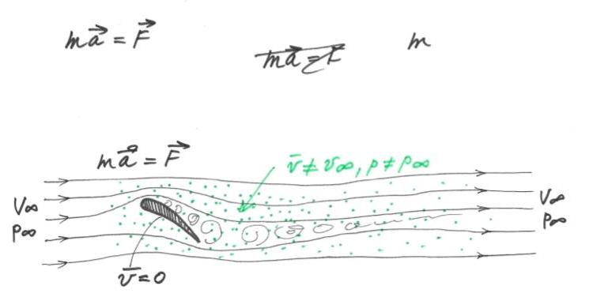

*Возмущённый объём вокруг тела в потоке*

Помещение тела в поток → Изменение полей скорости и давления → Появление напряжений → Реализация силы на границе потока и тела

Возмущённый объём очень велик — возможно, в 100 раз больше самого тела. Представьте себе этот объём, в котором скорость и давление отличаются от невозмущённого потока, а в центре находится тело, на поверхности которого скорость равна нулю. Закон сохранения импульса (второй закон Ньютона) должен выполняться в каждой точке. Поле напряжений — нормальных и касательных, — которое при этом возникает, не имеет другого места приложения, кроме поверхности тела. Это и есть аэродинамическая сила.

Аэродинамическую силу можно представить как непрерывную функцию параметров потока и тела:

$$\mathbf{F} = f(\rho, v_{\infty}, p_{\infty}, \mu, \text{геометрия тела})$$

- Скорость и давление в невозмущённом потоке: $v_{\infty}$, $p_{\infty}$

- Внутри возмущённого объёма: $v \ne v_{\infty}$, $p \ne p_{\infty}$

- На поверхности тела (условие прилипания): $v = 0$

## 2. Параметры потока и тела обтекания

[↑ Содержание](#содержание)

### Параметры потока

- Скорость $V$, м/с

- Давление $P$, Па

- Плотность $\rho$, кг/м³ (для несжимаемой жидкости $\rho = \text{const}$)

- Температура $T$, К

- Вязкость $\mu = \frac{\tau}{dv/dy}$, Па·с (для невязкой жидкости $\mu = 0$)

- Число Рейнольдса $Re = \frac{\rho V L}{\mu}$

### Параметры тела

- Геометрия профиля

- Ориентация в потоке

- Шероховатость поверхности

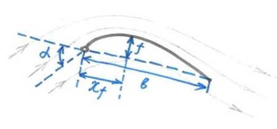

*Геометрия профиля паруса*

Обозначения геометрии профиля:

- $b$ — хорда

- $f$ — максимальная глубина

- $f/b$ — глубина пуза

- $x_f$ — положение пуза

- $\alpha$ — угол атаки

## 3. Компоненты аэродинамической силы

[↑ Содержание](#содержание)

Аэродинамическая сила может быть представлена в виде любой суммы векторов в зависимости от практической задачи и выбранной системы координат.

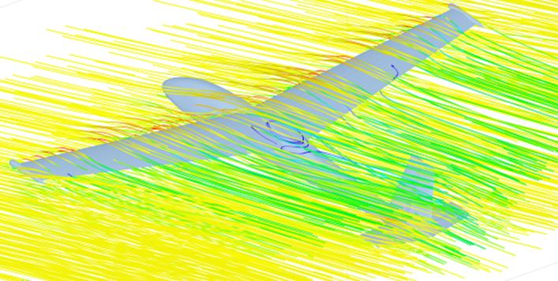

*CFD-обтекание самолёта*

### Обозначения

- $A$ — аэродинамическая сила

- $L$ (lift) — подъёмная сила

- $D$ (drag) — сопротивление

- $FD$ (forward driving force) — сила в направлении движения лодки

- $H$ (heeling force) — кренящая сила

### Разложения

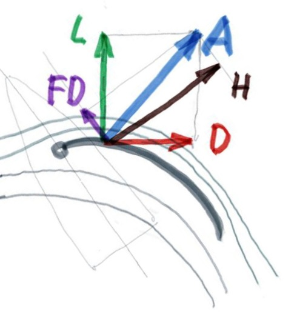

*Разложение по осям лодки: A = FD + H. FD — сила в направлении движения, H — кренящая сила*

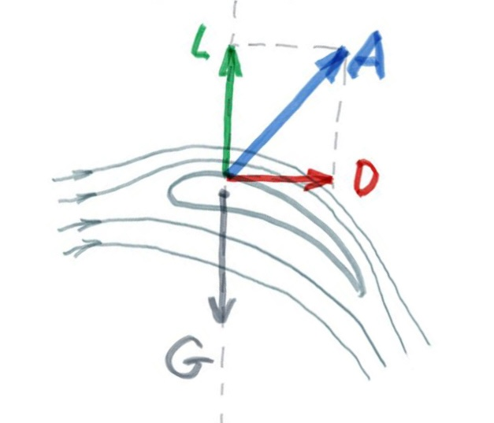

*Разложение по направлениям потока: A = L + D. L — подъёмная сила, D — сопротивление*

По направлениям потока: $\vec{A} = \vec{L} + \vec{D}$

По осям лодки: $\vec{A} = \vec{FD} + \vec{H}$

Итого: $\vec{A} = \vec{L} + \vec{D} = \vec{FD} + \vec{H}$

Можно ли сказать, что lift — это сумма сил давления, а drag — сумма сил трения? Нет, это неверная интерпретация — и lift, и drag складываются из обеих составляющих.

Часто пишут, что подъёмная сила — это сумма сил давления, а сопротивление — сумма сил трения. Это упрощение. Сопротивление включает не только трение, но и сопротивление формы (form drag), которое обусловлено полем давления, а не трением. Аэродинамическую силу следует рассматривать как единое объективное явление, которое затем можно разложить на компоненты по мере необходимости.

### ⚠️ Некорректная схема
На этом рисунке парус изображён как «толкаемый» ветром. В действительности аэродинамическая сила складывается из давления и трения на обеих сторонах паруса, а не из «толкающей» и «подъёмной» составляющих.

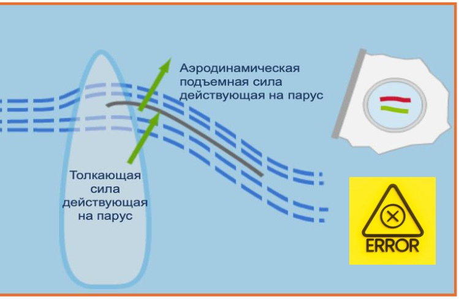

*Неправильная интерпретация сил на парусе*

На некорректной схеме показано распространённое заблуждение: что на одних курсах парус работает как «ветровой мешок», а на других — как крыло. В действительности это всегда одна и та же аэродинамическая сила.

## 4. Методы определения аэродинамической силы

[↑ Содержание](#содержание)

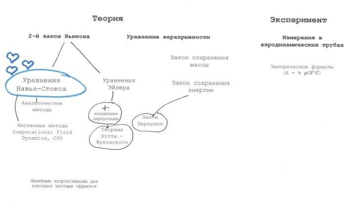

*Схема методов определения аэродинамической силы: теория и эксперимент*

### Теория

Фундаментальные законы:

- 2-й закон Ньютона: $m\mathbf{a} = \mathbf{F}$

- Уравнение неразрывности (закон сохранения массы)

- Закон сохранения энергии

Для реальной жидкости:

- Уравнения Навье–Стокса

- Аналитические методы

- Численные методы (CFD — Computational Fluid Dynamics)

Для идеальной жидкости:

- Уравнения Эйлера

- Концепция циркуляции

- Теорема Кутты–Жуковского

- Закон Бернулли

Линейные аппроксимации применяются для описания частных эффектов.

Если бы у Натальи было 30 секунд на описание методов определения аэродинамической силы, она сказала бы две вещи: уравнения Навье–Стокса и испытания в аэродинамической трубе. Всё остальное — контекст.

Уравнения Эйлера были разработаны первыми — для идеальной жидкости. Затем Навье и Стокс (разные люди) вывели уравнения для реальной (вязкой) жидкости. Уравнения Навье–Стокса — это «уравнения всех времён и народов»: они описывают любую реальную жидкость — воздух вокруг парусов, воду вокруг килей, погоду, океанские течения, даже кетчуп, вытекающий из бутылки.

Аналитические решения существуют только для простых случаев (без турбулентности, простая геометрия). Но с помощью CFD — численных методов в сочетании с уравнениями Навье–Стокса — можно рассчитать практически всё.

### Эксперимент

Методы измерения:

- Измерения в аэродинамических трубах

- Полевые измерения

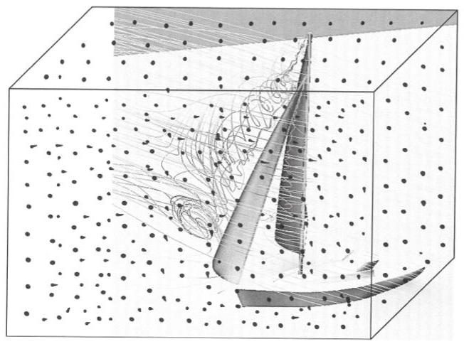

*CFD-расчёт: 3D-моделирование обтекания парусов с визуализацией вихрей*

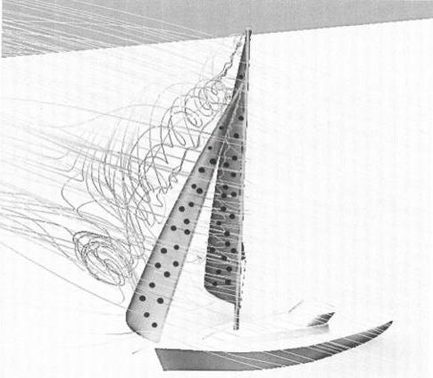

*Измерения: продувка модели паруса в аэродинамической трубе с визуализацией потока*

Эмпирическая формула: $A = \frac{1}{2} \rho S V^2 C$

где $A$ — аэродинамическая сила, $\rho$ — плотность среды, $S$ — характерная площадь, $V$ — скорость потока, $C$ — безразмерный аэродинамический коэффициент.

Для расчёта применяется CFD. Идеальная жидкость не учитывает вязкость, реальная — учитывает.

## 5. Уравнения Навье–Стокса

[↑ Содержание](#содержание)

### В векторной форме

1. Уравнение сохранения массы (из уравнения неразрывности):

$$\frac{\partial \rho}{\partial t} + \nabla \cdot (\rho \vec{v}) = 0$$

Для несжимаемой жидкости: $\nabla \cdot \vec{v} = 0$ (дивергенция скорости равна нулю).

2. Уравнение сохранения импульса (из 2-го закона Ньютона):

$$\rho \frac{D\vec{v}}{Dt} = -\nabla p + \mu \nabla^2 \vec{v} + \vec{G}$$

где:

- $\rho \frac{D\vec{v}}{Dt}$ — полная (материальная) производная скорости

- $-\nabla p$ — силы давления (градиент давления)

- $\mu \nabla^2 \vec{v}$ — вязкие силы (лапласиан скорости)

- $\vec{G}$ — силы гравитации

### В компонентной форме

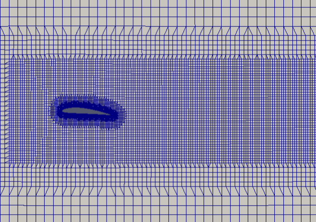

*Расчётная сетка вокруг профиля: сетка сгущается у поверхности, где нужна точность для пограничного слоя*

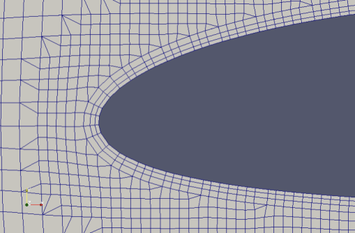

*Увеличение расчётной сетки у передней кромки профиля*

Локальные физические свойства потока $V_x, V_y, V_z, p$ представлены непрерывными функциями координат и времени. Уравнения учитывают вязкость и позволяют описывать турбулентность.

Уравнение неразрывности говорит, что дивергенция поля скорости для несжимаемой жидкости равна нулю. Уравнение сохранения импульса содержит четыре ключевых члена: локальное ускорение (производная по времени), конвективное ускорение (самый неприятный член — когда он доминирует над вязкостью, возникает турбулентность и расчёты становятся очень сложными), градиент давления и вязкие силы (лапласиан). Конвективный член — «самый нелюбимый», потому что когда он больше вязкого, это означает турбулентный поток, при котором малые изменения входных данных приводят к огромным изменениям результата.

## 6. Теория циркуляции, теорема Кутты–Жуковского

[↑ Содержание](#содержание)

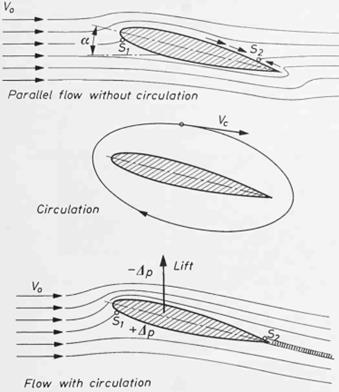

*Обтекание профиля без циркуляции и с циркуляцией (Marchaj)*

- Расчёт для идеальных условий давал отсутствие подъёмной силы и физически невозможные результаты на острой задней кромке.

- Плавный сход потока обеспечивался предположением наличия вязкости и формирования вихря, который сходит с задней кромки.

- Этот вихрь «запускает» ещё один вихрь вокруг тела с силой $\Gamma$.

- Наложение его на исходный поток даёт подъёмную силу, пропорциональную величине циркуляции:

$$L = \rho V_{\infty} \Gamma$$

Циркуляция: $\Gamma = \oint \vec{V} \cdot d\vec{s}$, размерность $[м^2/с]$

Ланкастер, Кутта и Жуковский, около 1900 г. Источник: C. A. Marchaj, *Aerohydrodynamics of Sailing*.

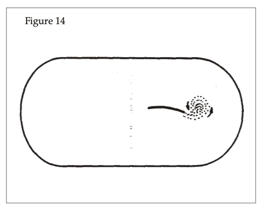

*Стартовый вихрь (Gentry, Figure 14)*

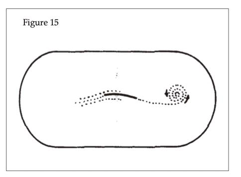

*Стартовый вихрь и циркуляция (Gentry, Figure 15)*

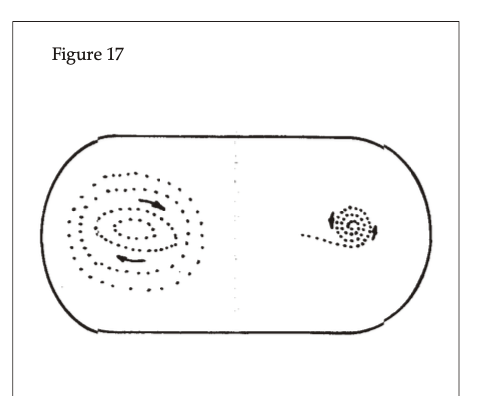

*Развитие циркуляции вокруг профиля (Gentry, Figure 17)*

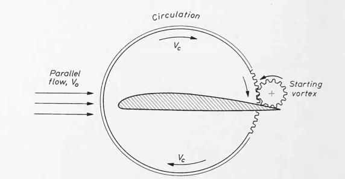

*Параллельный поток + циркуляция + стартовый вихрь (Marchaj)*

### Применение теории циркуляции

Преимущества:

- Очень красивая теория

- Даёт очень хорошие результаты расчёта силы

- Аналитический расчёт для идеальной жидкости относительно прост

- Оперирует идеальным потоком вдали от пограничного слоя, где вязкость и другие неидеальности наиболее важны

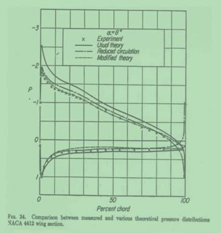

*Сравнение расчётных и экспериментальных распределений давления (Abbot, Von Doenhoff)*

Это альтернативный взгляд на объяснение подъёмной силы, однако физической причиной возникновения аэродинамической силы остаются нормальные и касательные напряжения на поверхности тела.

Красота теории циркуляции в том, что оба компонента расчёта — идеальный поток и поле циркуляции — могут быть вычислены без учёта вязкости. Основной поток рассчитывается по Эйлеру (строго говоря, неправильно, но это неважно, потому что наложение циркуляции корректирует результат), а циркуляция тоже может быть рассчитана для идеальной жидкости, поскольку она действует вдали от пограничного слоя. На протяжении ста лет до появления CFD это был единственный практический метод расчёта.

### Ограничения интерпретации

Нельзя интерпретировать теорию циркуляции так:

- циркуляция *вызывает* подъёмную силу

- циркуляция *объясняет* высокую скорость с подветренной стороны

- поток воздуха *физически вращается* вокруг паруса

Ни Кутта, ни Жуковский никогда не писали, что циркуляция вызывает подъёмную силу. Они писали, что поле, создающее подъёмную силу, может быть представлено как суперпозиция идеального поступательного потока и вращающегося потока, и что подъёмная сила пропорциональна величине циркуляции.

Эксперимент на правом рисунке показывает: когда профиль убирают из потока, циркуляция становится видна как реальный вихрь в жидкости. Пока профиль находится в потоке, ничего видимым образом не вращается.

### ⚠️ Некорректные схемы
На этих рисунках циркуляция показана как физическое вращение воздуха вокруг паруса, а подъёмная сила — как результат этого вращения. Это заблуждение: циркуляция — математический инструмент расчёта, а не физический механизм.
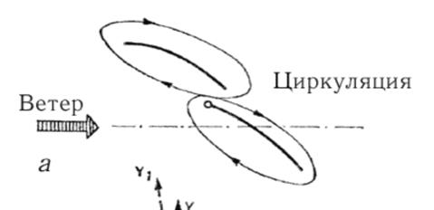

*Некорректная интерпретация: воздух «вращается» вокруг паруса*

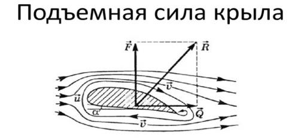

*Некорректная интерпретация: подъёмная сила как результат циркуляции*

## 7. Закон Бернулли

[↑ Содержание](#содержание)

Уравнение Бернулли вдоль линии тока:

$$\frac{v^2}{2} + gh + \frac{p}{\rho} = \text{const}$$

Или: $\frac{1}{2}\rho v^2 + \rho g h + p = \text{const}$ (динамическое давление + потенциальная энергия + статическое давление)

Условия применимости:

- стационарное течение: $\frac{\partial \vec{v}}{\partial t} = 0$

- несжимаемая жидкость: $\rho = \text{const}$

- невязкая жидкость: $\mu = 0$

Сумма динамического и статического давлений в идеальной жидкости постоянна вдоль линии тока.

### Ограничения

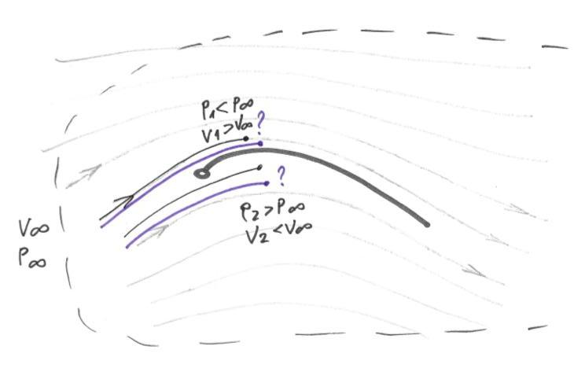

*Закон Бернулли: хорошо работает вдоль трубки тока, но неизвестно где именно вокруг профиля*

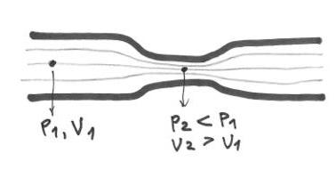

*Закон Бернулли вдоль трубки тока — хорошо работает*

- Для расчётов нужно знать положение линий тока

- Для объяснения возникновения подъёмной силы — не обладает причинностью (каузальностью)

Закон Бернулли не содержит причинности. Он не говорит, что идёт первым. Он говорит, что сумма постоянна. Люди утверждают: «циркуляция вызывает более высокую скорость, затем по Бернулли более высокая скорость означает более низкое давление, отсюда подъёмная сила». Но Бернулли не говорит, что если скорость увеличилась, то давление обязательно уменьшилось как причина. Для атмосферного воздуха всё наоборот — воздух движется под действием горизонтального градиента давления. Ветер — это и есть воздух, пришедший в движение из-за разности давлений. Сначала давление, потом скорость — противоположно тому, как это обычно объясняют.

Закон Бернулли прекрасно работает в трубках, где известна геометрия. Вокруг сложного тела вроде крыла он подобен звонящему в сумке телефону: мы знаем, что он где-то работает, но не знаем точно, где именно.

## 8. Объяснения «феномена подъёмной силы»

[↑ Содержание](#содержание)

В разных комбинациях: 1+2, 1+3, 1+4, 1+5, 1+6, 1+8, 3+4, ...

1. Закон Бернулли — действует не везде вдоль крыла и не всегда
2. **Теория равного времени обтекания — НЕВЕРНАЯ**
3. Теория циркуляции (теорема К–Ж) — хороша, но не объясняет возникновение подъёмной силы
4. Сохранение импульса (реакция на поворот потока при сходе с задней кромки)
5. Эффект Коанды — не объясняет возникновение подъёмной силы и потока вокруг тела
6. Эффект Вентури — не объясняет возникновение подъёмной силы и потока вокруг тела
7. **Механическое взаимодействие частиц воздуха с поверхностью крыла — НЕВЕРНАЯ**
8. **Сжатие струек (трубок тока) над профилем из-за кривизны верхней поверхности — НЕВЕРНАЯ**
9. **Плотность воздуха над профилем ниже, чем под профилем — НЕВЕРНАЯ**

Само выражение «феномен подъёмной силы» вводит в заблуждение. Никакого феномена нет. Подъёмная сила — это просто компонент аэродинамической силы. «Феномен» здесь психологический: кажется нелогичным, что тело тяжелее воздуха испытывает силу, направленную вверх. Никто не говорит о «феномене трения». Чем больше объяснение «щёлкает» интуитивно, тем менее корректным оно, как правило, оказывается.

## 9. Испытания в аэродинамических трубах

[↑ Содержание](#содержание)

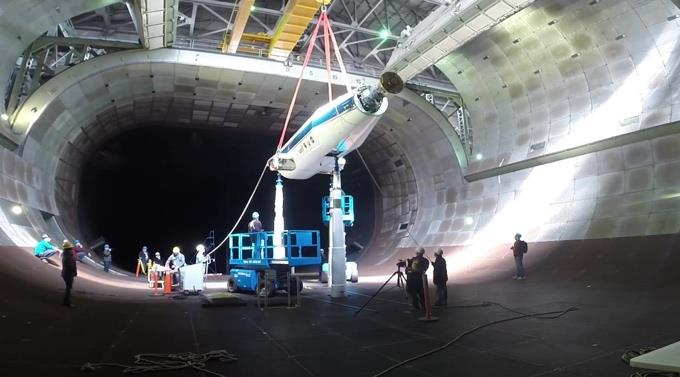

*Модель яхты в TFWT (Twisted Flow Wind Tunnel)*

Источник: H. Hansen et al., *Advances in the Wind Tunnel Analysis of Yacht Sails*

TFWT (Twisted Flow Wind Tunnel) — специальная аэродинамическая труба, спроектированная для испытаний парусов, в которой поток меняется по высоте, имитируя ветровой сдвиг. Степень этого сдвига может быть настроена произвольно.

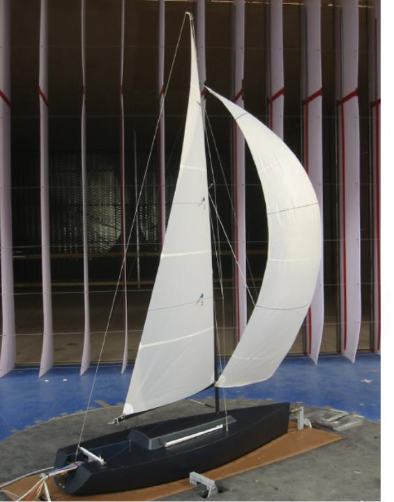

*Аэродинамическая труба в NASA Ames Center*

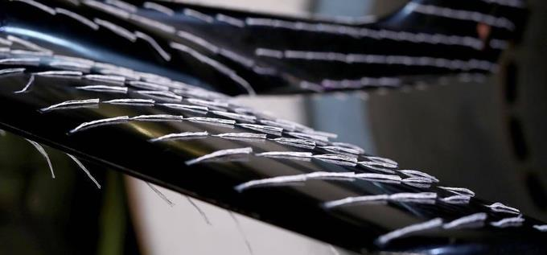

*Визуализация методом шёлковинок*

Источник: https://tass.ru/tech/6816430

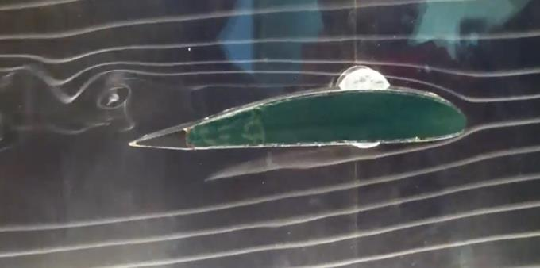

*Дымовая визуализация обтекания паруса*

### Методы измерений

- Прямое измерение составляющих аэродинамической силы и их моментов

- Измерение давления и приближённый расчёт сил

- Визуализация структуры потока (шёлковинки, дымовая визуализация)

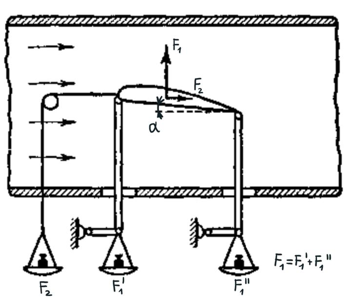

*Схема измерения аэродинамической силы с помощью весов в аэродинамической трубе: Y (lift) и X (drag) измеряются раздельно*

## 10. Аэродинамические коэффициенты профиля

[↑ Содержание](#содержание)

$Y$ и $X$ (а также моменты, давление и другие измеряемые характеристики) верны для модели. Чтобы применить их к парусу любых размеров, используются безразмерные коэффициенты:

$$C_y = \frac{2Y}{\rho V^2 S}, \quad C_x = \frac{2X}{\rho V^2 S}$$

Аэродинамическое качество: $K = \frac{C_y}{C_x}$

### Зависимость подъёмной силы от угла атаки

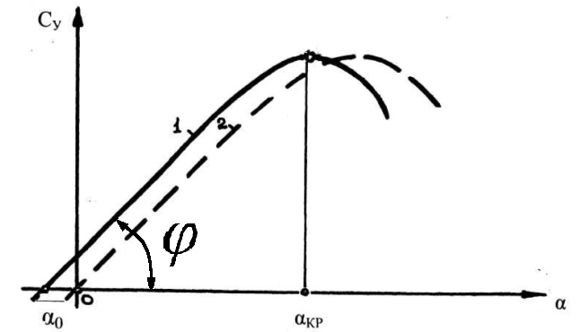

*Cy в зависимости от угла атаки α: линейный рост до αкр, затем срыв*

$C_y = f(\alpha)$ — при увеличении угла атаки $\alpha$ коэффициент $C_y$ растёт. После критического угла $\alpha_{кр}$ происходит срыв потока и падение подъёмной силы.

### Поляра профиля

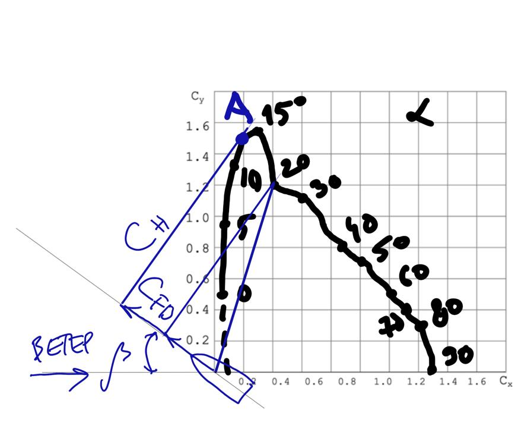

*Поляра профиля — Cy в зависимости от Cx и угла атаки. На диаграмме отмечены углы атаки от 0° до 90°, силы CH, CFD и направление ветра*

Поляра (полярная диаграмма) — график изменения $C_y$ в зависимости от $C_x$ и угла атаки $\alpha$.

### Влияние формы профиля

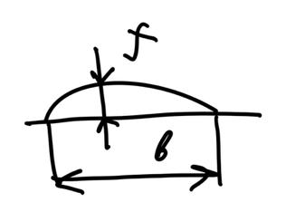

*Хорда b и глубина пуза f*

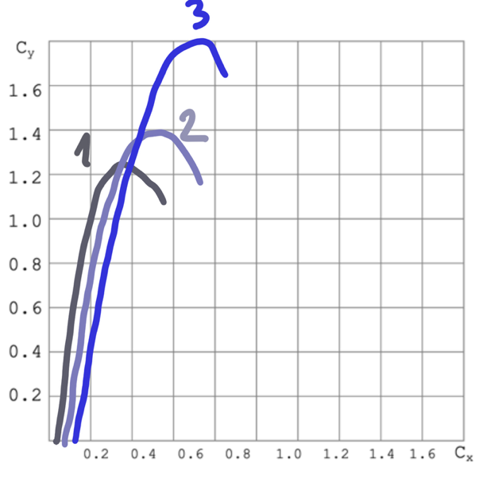

*Влияние кривизны профиля на поляру: больше пуз (f/b) → выше Cy max и лучше K*

Для профилей различной кривизны:

- $f/b_1 > f/b_2 > f/b_3$

- $C_{y\,\text{max}\,1} > C_{y\,\text{max}\,2} > C_{y\,\text{max}\,3}$

- $K_1 > K_2 > K_3$

Парус с наибольшей глубиной пуза даёт максимальную подъёмную силу, но при этом минимальное аэродинамическое качество $K$. Максимум подъёмной силы сопровождается плохим отношением подъёмной силы к сопротивлению.

## 11. Поляра лодки по VPP

[↑ Содержание](#содержание)

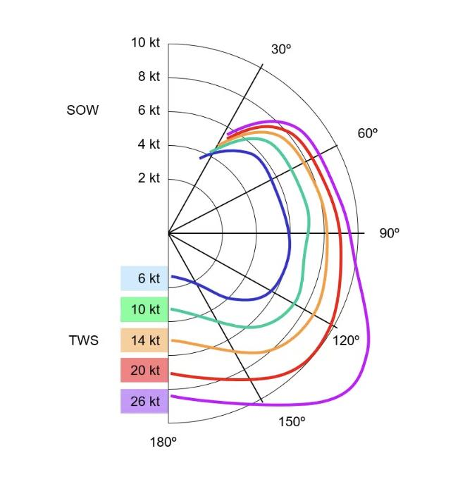

*Поляра лодки — скорость (SOW) в зависимости от TWS (6–26 уз) и TWA (30°–180°)*

Показывает скорость лодки (Speed Over Water) в зависимости от истинной скорости ветра (True Wind Speed) и угла к ветру (True Wind Angle). Можно построить по собственным экспериментальным данным (но это очень сложно).

### VPP (Velocity Prediction Program)

Компьютерное моделирование на основе:

- гидродинамических данных

- результатов продувок в аэродинамических трубах

- in-flight измерений

- CFD

Используется как основа для рейтинговых систем ORC и IMS.

### Пример: оптимальный TWA

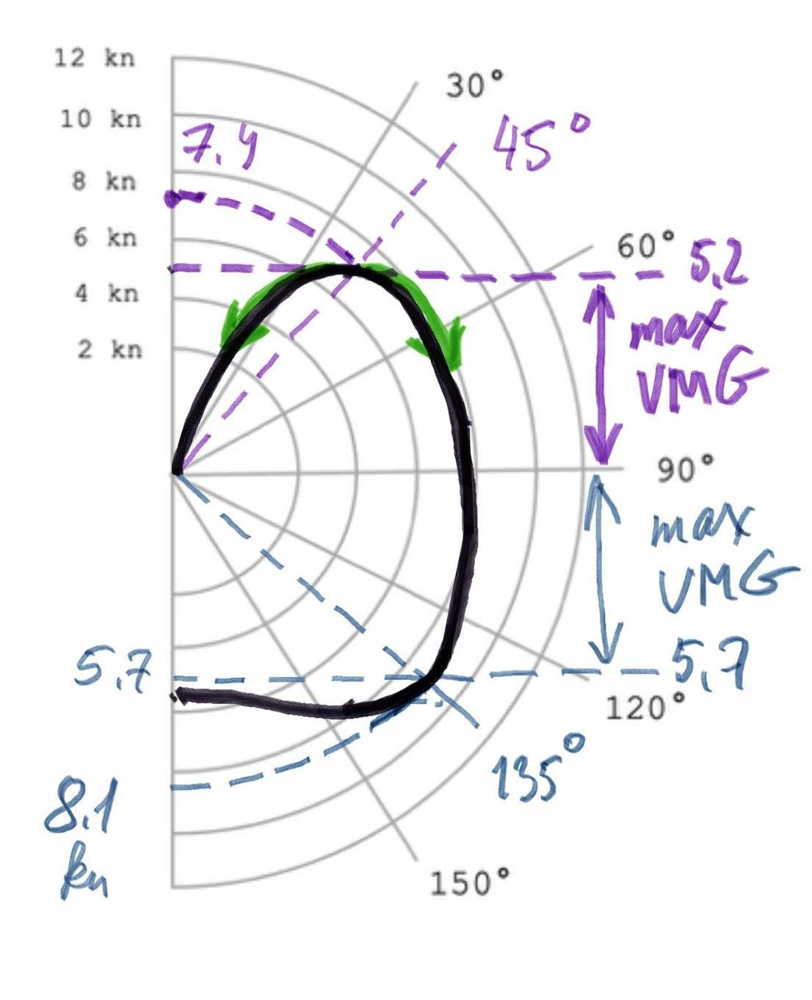

*Пример использования поляры VPP при TWS 14 уз: optimal TWA 45° upwind (VMG 5.2 kn) и 135° downwind (VMG 5.7 kn)*

Upwind:

- optimal TWA — 45°

- target boat speed — 7.4 kn

- max VMG — 5.2 kn

- Helm — рулить 45° к TW; Trim — добить до 7.4 узлов

Downwind:

- optimal TWA — 135°

- target boat speed — 8.1 kn

- max VMG — 5.7 kn

Плавание под любым другим углом уменьшит VMG: меньший угол — выше, но хуже скорость; больший угол — ниже, но лучше скорость.

## 12. Коэффициенты давления

[↑ Содержание](#содержание)

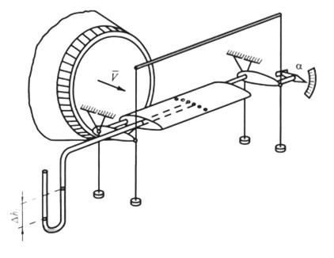

*Измерение коэффициента давления и его распределение по профилю*

$$c_{p_i} = \frac{p_i - p_\infty}{\frac{1}{2}\rho V_\infty^2}$$

где $p_i$ — давление в точке на поверхности профиля, $p_\infty$ — давление невозмущённого потока, $V_\infty$ — скорость невозмущённого потока. $p_i$ измеряется в аэродинамической трубе.

### Интерпретация

- Коэффициент давления $C_p$, в отличие от давления $p$, может быть отрицательным и может представляться в виде вектора

- Низкое и высокое давление — относительно атмосферного

- Разрежение (suction): подветренная сторона паруса никуда не «засасывается» — воздух давит на неё, просто несколько меньше

Слово «разрежение» (suction) сразу вызывает образ пылесоса или макаронины, которую втягивают из кастрюли. Ничего подобного не происходит. Подветренная сторона паруса никуда не засасывается. Воздух давит на неё, просто чуть-чуть меньше, чем на наветренную сторону. Для Boeing 777 на крейсерской высоте разница давлений составляет всего около 6000 Па — здоровый человек даже не почувствовал бы такое изменение, выйдя на улицу. Бытовой пылесос создаёт 15 000 Па. Тем не менее этой крошечной разницы достаточно, чтобы удерживать самолёт в воздухе.

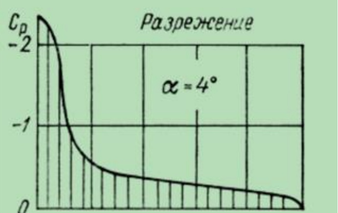

*Распределение Cp при угле атаки α = 4°: разрежение (отрицательный Cp) на подветренной стороне, повышенное давление на наветренной*

### Оценка давления (пример)

Крыло Boeing 777 на высоте 10 000 м:

- 21 100 Па — над крылом

- 27 000 Па — под крылом

- Разница ≈ 6 000 Па

- Для сравнения: разница давления в бытовом пылесосе ≈ 15 000 Па

- Давление на высоте 10 000 м: 26 436 Па

- Давление на уровне моря: 101 325 Па

### ⚠️ Некорректная схема
На этом рисунке векторы давления направлены наружу от профиля с обеих сторон, как будто парус «раздувается». В действительности давление давит на обе стороны паруса внутрь, просто с подветренной стороны оно несколько меньше.
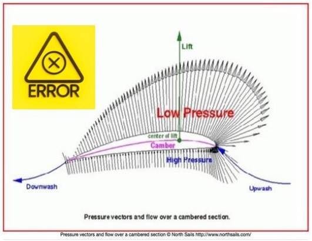

*Некорректная интерпретация: векторы давления направлены от профиля наружу (источник: North Sails)*

## 13. Линии течения

[↑ Содержание](#содержание)

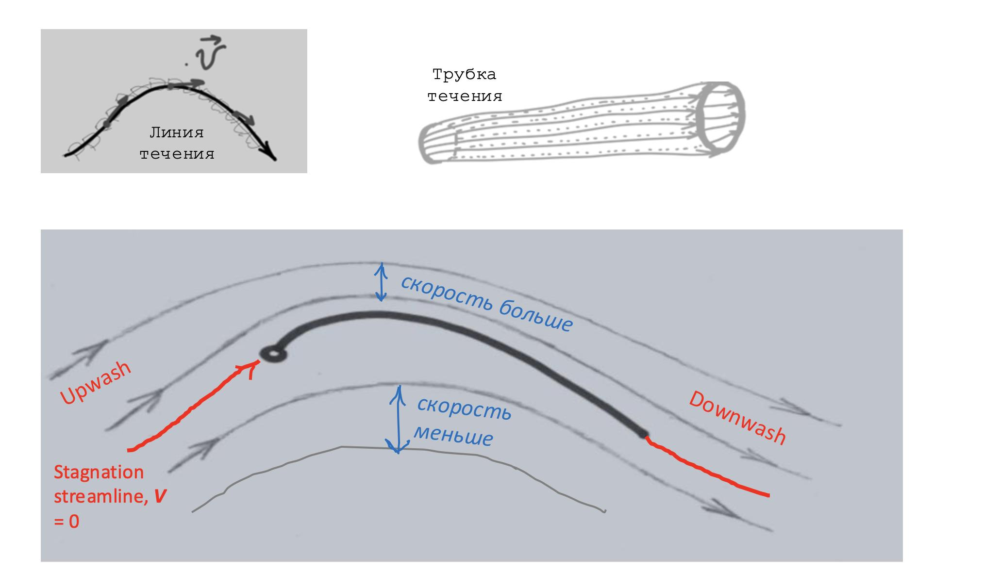

*Линия течения, трубка течения, stagnation streamline (V=0), upwash и downwash. На подветренной стороне расстояние между линиями тока меньше — скорость больше*

Линия течения — траектория частицы жидкости. Трубка течения — пучок линий течения.

Ключевые понятия:

- Stagnation streamline ($V = 0$) — линия, на которой поток разделяется

- Upwash — поток перед профилем поднимается вверх

- Downwash — поток за профилем отклоняется вниз

- На подветренной стороне скорость больше, на наветренной — меньше

## 14. Поля давления и скоростей

[↑ Содержание](#содержание)

Расчёт линий течения вокруг одного паруса для разных углов атаки без учёта вязкости (кроме условия Кутты). Источник: A. Gentry, *The Aerodynamics of Sail Interaction*.

### α = 25°

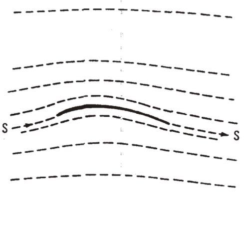

*Поля давления и скоростей при α = 25°: поток разделяется на передней кромке*

- Поток разделяется точно на передней кромке

- Плавное уменьшение давления и увеличение скорости на подветренной стороне от передней кромки до точки максимальной глубины профиля

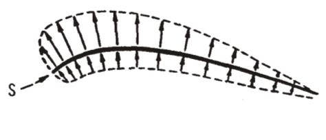

*Распределение давления вдоль профиля при α = 25°*

### α = 35°

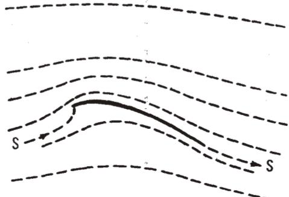

*Поля давления и скоростей при α = 35°: поток разделяется на наветренной стороне*

- Поток разделяется на наветренной стороне

- Минимум давления на передней кромке, затем резкое увеличение до точки максимальной глубины, далее плавное увеличение к задней кромке

- Для скорости — обратная картина

- Больше разница давлений → больше подъёмная сила

- Но из-за положения stagnation streamline на передней части паруса возникает резкий рост давления

- Если бы в расчётах учитывалась вязкость — можно было бы увидеть срыв потока на передней кромке или по всему профилю

## 15. Ламинарный и турбулентный потоки

[↑ Содержание](#содержание)

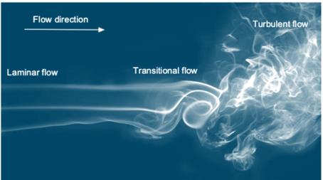

*Ламинарный, переходный и турбулентный потоки*

### Свойства турбулентного потока

- Перемешивание слоёв → появление компонентов скорости поперёк основного направления

- Увеличение сечения струи → вовлечение дополнительной массы воздуха

- Поступательная скорость потока, как правило, уменьшается

### Переход ламинарного потока в турбулентный

Должны выполняться два условия:
1. «Термодинамическое» — новое состояние должно быть устойчивым
2. «Триггер» — возмущение потока (препятствие, флуктуации давления или плотности, завихренность и т.д.)

Переход из ламинарного режима в турбулентный можно представить как фазовый переход — вода в пар, лёд в воду. Должны выполняться два условия: новое состояние должно быть термодинамически устойчивым и должен быть триггер. Подобно тому как переохлаждённая вода может оставаться жидкой ниже нуля, поток с высоким $Re$ может некоторое время оставаться ламинарным, но чем выше $Re$, тем меньшее возмущение потребуется для перехода.

Шероховатость поверхности может выступать триггером перехода (например, загрязнение корпуса лодки — поэтому так важно чистить дно).

### Число Рейнольдса

$$Re = \frac{\rho V L}{\mu}$$

Поток может стабильно существовать в турбулентном режиме, если силы инерции значительно превышают силы вязкости.

Может ли поток с большим $Re$ оставаться ламинарным? Да, если отсутствует триггер. Но чем больше $Re$, тем более неустойчиво ламинарное состояние.

Типичные порядки: ламинарный $Re \sim 10^{-3}$; турбулентный $Re \gtrsim 10^5$.

### Re для разных случаев

Для паруса ($L = 2$ м, $\rho = 1.225$ кг/м³, $V \approx 10$ уз ≈ 5 м/с, $\mu \approx 18 \cdot 10^{-6}$ Па·с):

$$Re = \frac{1.225 \cdot 5 \cdot 2}{18 \cdot 10^{-6}} \approx 2.2 \cdot 10^6$$

Всё определяет вязкость. У воздуха она очень маленькая, поэтому большинство воздушных потоков турбулентные. Атмосферный воздух вообще не существует без турбулентных явлений.

В воде: $\mu \approx 10^{-3}$ → $Re$ примерно в 1000 раз меньше.

Ещё одна переменная, сильно влияющая на $Re$ — линейный масштаб $L$. Поэтому насекомых не «сносит» воздухом, а кровь не турбулизируется.

## 16. Пограничный слой

[↑ Содержание](#содержание)

- Возникает из-за вязкости воздуха — не рассматривается в теориях идеальной жидкости

- Скорость на поверхности паруса равна нулю: $v = 0$ (no-slip boundary condition)

- Слой очень тонкий — порядка миллиметра, на схемах изображается не в масштабе

- По толщине слоя скорость изменяется от $0$ до $V_\infty$ (эпюра скорости)

- Форма эпюры зависит от режима: ламинарный или турбулентный

На поверхности нет «прилипания» — правильнее представлять это как проваливание воздуха в шероховатость поверхности на масштабе молекул.

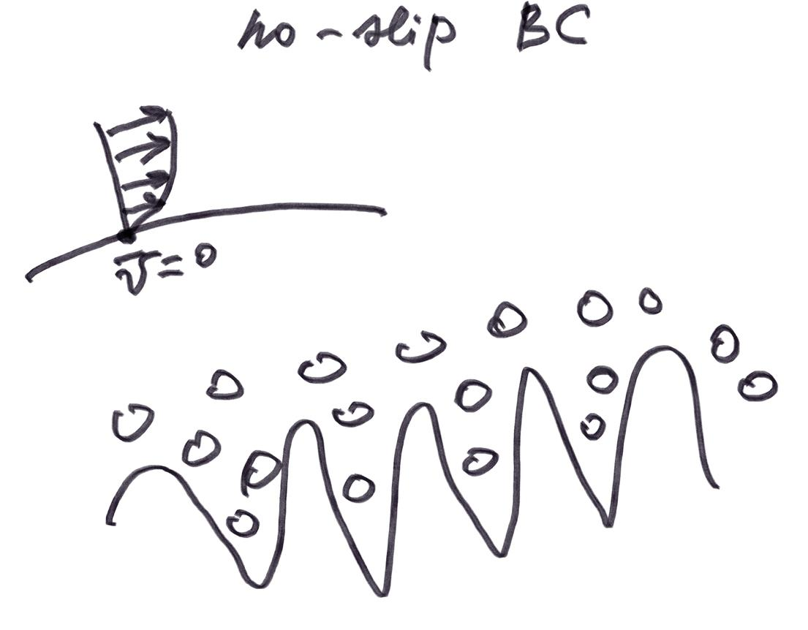

*No-slip boundary condition: скорость на поверхности равна нулю (v=0), воздух «проваливается» в шероховатость поверхности на молекулярном масштабе*

### Ламинарный пограничный слой

Доминирует вязкость → плавное, послойное изменение скорости.

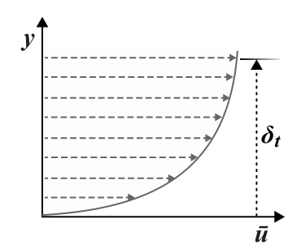

*Эпюра скорости ламинарного пограничного слоя*

### Турбулентный пограничный слой

Доминирует инерция → интенсивное перемешивание. Средний профиль скорости имеет более «полную» форму — практически вертикальная стенка на эпюре.

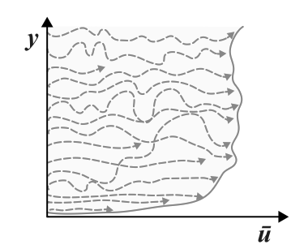

*Эпюра скорости турбулентного пограничного слоя*

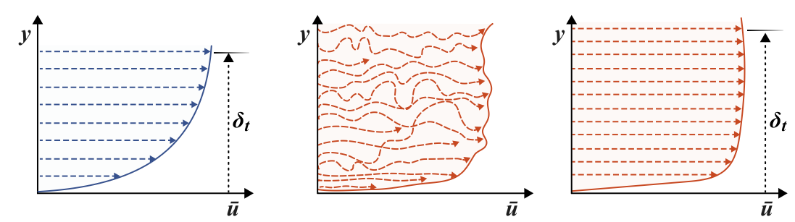

*Сравнение эпюр: ламинарный (плавная кривая), мгновенный турбулентный (хаотичный), осреднённый турбулентный (полный профиль)*

### Развитие турбулентности в пограничном слое

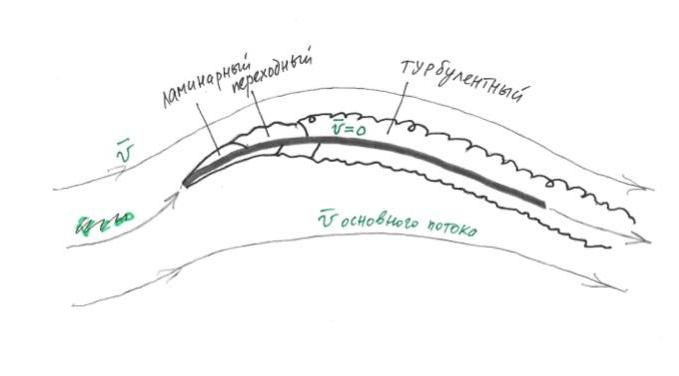

*Пограничный слой на профиле: ламинарный → переходный → турбулентный*

- Пограничный слой формируется с обеих сторон профиля

- На наветренной стороне он тоньше и турбулентность развивается медленнее

- Переход обычно происходит вблизи точки максимальной глубины паруса

- На подветренной стороне толще и раньше переходит в турбулентный (выше скорость → больше $Re$)

- Переход зависит от числа Рейнольдса и триггеров (шероховатость)

Неровность паруса (швы и т.д.) не приводит к отрыву пограничного слоя и срыву потока. Она является триггером перехода из ламинарного в турбулентное состояние. Пограничный слой может прекрасно быть турбулентным и никуда не срываться.

На вопрос о толщине пограничного слоя на парусе Наталья ответила: около миллиметра, невидимо невооружённым глазом. Но это для случая без отрыва. Шероховатость поверхности паруса (швы и прочее) не вызывает отрыв потока — она является триггером перехода из ламинарного режима в турбулентный. Пограничный слой может прекрасно оставаться турбулентным и при этом не отрываться.

Если пограничный слой не отрывается — подъёмная сила практически не теряется (поле давления над тонким слоем почти не меняется), но немного увеличивается сопротивление из-за бо́льшего поверхностного трения в турбулентной части.

## 17. Отрыв пограничного слоя

[↑ Содержание](#содержание)

Причина: вязкость + обратный градиент давления вдоль профиля.

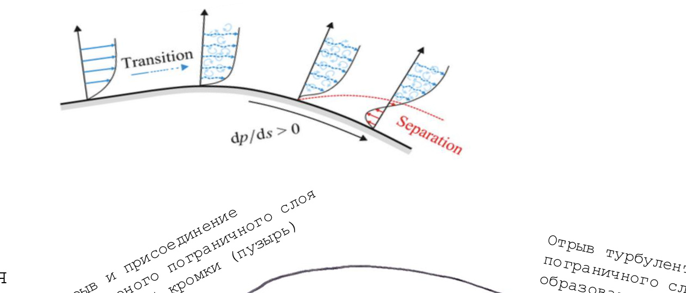

*Отрыв пограничного слоя: transition и separation*

Важно различать два термина:

- Отрыв пограничного слоя (separation) — процесс отсоединения слоя от поверхности

- Срыв потока (stall) — результат, когда слой отсоединился и не присоединился обратно → падение подъёмной силы

### Два случая отрыва

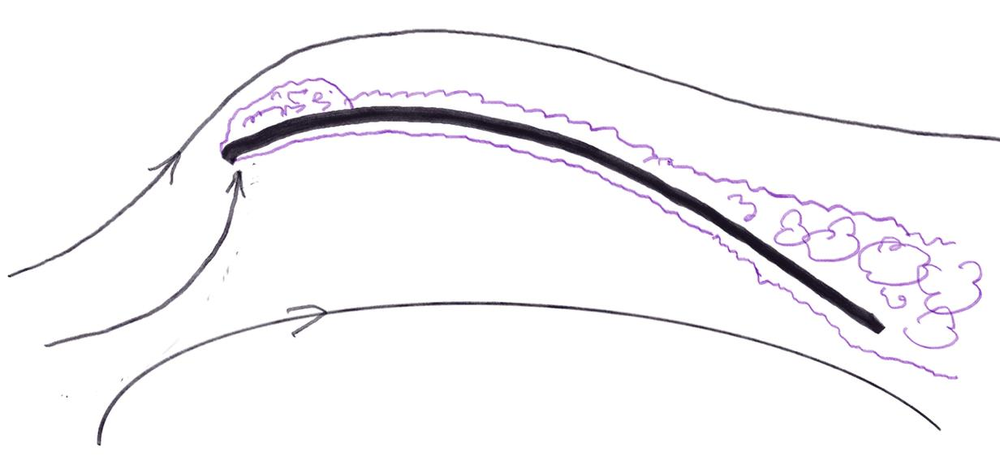

*Слева: отрыв и присоединение ламинарного слоя у передней кромки (пузырь). Справа: отрыв турбулентного слоя с образованием вихревой зоны*

1. Отрыв и обратное присоединение (separation–reattachment): ламинарный слой отрывается у передней кромки, но присоединяется обратно (пузырь). В худшем случае — не возвращается, полный срыв сразу.

2. Отрыв турбулентного слоя: происходит ближе к задней кромке, после точки максимальной глубины. Толщина вихревой зоны сильно увеличивается — маленькие вихри затягивают «чистый» воздух из внешнего потока, образуя вихревую зону гораздо бо́льшего масштаба.

### Ключевые выводы

- Оторваться может и ламинарный, и турбулентный слой

- Турбулентный отрывается позже (лучше держится)

- Для самолётных крыльев ставят Vortex Generators — генераторы вихрей, искусственно поддерживающие турбулентность, чтобы отодвинуть момент отрыва

- Ямочки на мяче для гольфа формируют турбулентный пограничный слой → мяч дольше держится в воздухе и дальше летит

### Пример расчёта (CFD)

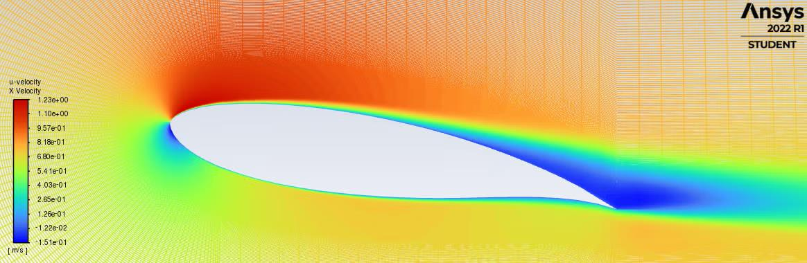

*Поле скоростей при отрыве пограничного слоя — ANSYS Fluent, RANS. Красное — высокая скорость, синее — низкая (зона отрыва за задней кромкой)*

ANSYS Fluent, модель RANS (Reynolds-Averaged Navier–Stokes) — одна из нескольких моделей, упрощающих расчёт уравнений Навье–Стокса.

На визуализации видно: после точки максимальной глубины профиля скорость уменьшается, пограничный слой отрывается и сильно увеличивается в толщине, подтягивая воздух из основного потока.

## Вопросы и ответы

[↑ Содержание](#содержание)

### О проницаемости паруса для воздуха

Парус считается непрозрачным для воздуха — это условие того, что он является телом обтекания. Старый, изношенный парус, через который можно смотреть, не является полноценным телом обтекания. Аэродинамическая сила на нём всё равно образуется, но будет меньше и направлена не туда, куда нужно.

### Парус vs крыло

Основное отличие в контексте отрыва: на крыле отрыв просто снижает подъёмную силу, а на парусе в месте отрыва парус теряет форму (бэквиндинг). Влияние мачты создаёт пузырь (bubble) у передней кромки грота. На стакселе тоже может быть отрыв у передней кромки.

С развитием CFD парус обсчитывается со всеми его физическими особенностями так же успешно, как и крыло.

## Словарь

[↑ Содержание](#содержание)

- **VMG (Velocity Made Good)** — проекция скорости лодки на направление к цели (ветру). Оптимизируется выбором TWA

- **VPP (Velocity Prediction Program)** — программа прогнозирования скорости яхты на основе гидро- и аэродинамических данных. Основа рейтинговых систем ORC и IMS

- **Аэродинамическая труба с закрученным потоком (TFWT, Twisted Flow Wind Tunnel)** — имитирует реальный ветер с твистом по высоте

- **[Аэродинамическое качество](https://ru.wikipedia.org/wiki/Аэродинамическое_качество) (K)** — отношение коэффициента подъёмной силы к коэффициенту сопротивления: $K = C_y / C_x$. Чем выше K, тем эффективнее профиль

- **Бэквиндинг (backwinding)** — потеря формы паруса в зоне отрыва потока; парус начинает полоскать с подветренной стороны

- **Возмущённый объём** — область вокруг тела, в которой скорость и давление отличаются от невозмущённого потока ($v \ne v_\infty$, $p \ne p_\infty$)

- **Восходящее и нисходящее отклонение потока (upwash / downwash)** — восходящее отклонение потока перед профилем и нисходящее за профилем. Связаны с перераспределением давления

- **[Вычислительная гидродинамика](https://ru.wikipedia.org/wiki/Вычислительная_гидродинамика) (CFD, Computational Fluid Dynamics)** — численное решение уравнений гидродинамики (обычно Навье–Стокса) на расчётной сетке

- **[Вязкость](https://ru.wikipedia.org/wiki/Вязкость) ($\mu$)** — свойство жидкости сопротивляться сдвиговым деформациям. Определяется как отношение касательного напряжения к градиенту скорости: $\mu = \tau / (dv/dy)$. Для воздуха $\mu \approx 18 \cdot 10^{-6}$ Па·с — очень малая величина, поэтому воздух легко переходит в турбулентный режим

- **[Генераторы вихрей](https://ru.wikipedia.org/wiki/Генератор_вихрей) (Vortex Generators)** — небольшие пластинки на поверхности крыла, создающие вихри для искусственного перевода пограничного слоя в турбулентный режим. Турбулентный слой лучше сопротивляется отрыву

- **[Градиент давления](https://ru.wikipedia.org/wiki/Градиент_давления)** — изменение давления вдоль профиля. Обратный (adverse) градиент давления (давление растёт по ходу потока) — причина отрыва пограничного слоя

- **[Дивергенция](https://ru.wikipedia.org/wiki/Дивергенция) скорости ($\nabla \cdot \vec{v}$)** — мера расходимости поля скоростей. Для несжимаемой жидкости равна нулю

- **Критическая линия тока (stagnation streamline)** — линия тока, на которой поток разделяется и скорость равна нулю ($V = 0$). При увеличении угла атаки смещается на наветренную сторону

- **[Лапласиан](https://ru.wikipedia.org/wiki/Оператор_Лапласа) скорости ($\nabla^2 \vec{v}$)** — вторая пространственная производная скорости, описывает диффузию импульса за счёт вязкости

- **[Линия тока](https://ru.wikipedia.org/wiki/Линия_тока) (streamline)** — кривая, в каждой точке которой вектор скорости касателен к ней. Жидкость не пересекает линии тока

- **[Материальная производная](https://ru.wikipedia.org/wiki/Субстанциональная_производная) ($D/Dt$)** — полная производная по времени, учитывающая и локальное изменение, и перенос (конвекцию): $D/Dt = \partial/\partial t + \vec{v} \cdot \nabla$

- **[Несжимаемая жидкость](https://ru.wikipedia.org/wiki/Несжимаемая_жидкость)** — жидкость с постоянной плотностью ($\rho = \text{const}$). Воздух при малых скоростях (до ~0.3 Маха) можно считать несжимаемым

- **Обратный градиент давления (adverse pressure gradient)** — рост давления вдоль направления движения потока. Воздух воспринимает это как «стенку» — именно это вызывает отрыв пограничного слоя

- **[Осреднённые уравнения Навье–Стокса](https://ru.wikipedia.org/wiki/Уравнения_Навье_—_Стокса,_осреднённые_по_Рейнольдсу) (RANS, Reynolds-Averaged Navier–Stokes)** — модель, упрощающая расчёт турбулентных потоков путём осреднения по времени

- **[Отрыв пограничного слоя](https://ru.wikipedia.org/wiki/Отрыв_потока) (separation)** — отсоединение пограничного слоя от поверхности тела. Может быть обратимым (reattachment) или необратимым (срыв потока)

- **[Поляра](https://ru.wikipedia.org/wiki/Поляра_(аэродинамика)) (полярная диаграмма)** — график зависимости $C_y$ от $C_x$ при разных углах атаки. Позволяет определить оптимальный угол атаки и аэродинамическое качество

- **Пуз (camber)** — максимальная глубина прогиба профиля $f$ относительно хорды $b$. Глубина пуза $f/b$ влияет на максимальный $C_y$ и аэродинамическое качество $K$

- **Разрежение (suction)** — зона пониженного давления на подветренной стороне паруса. Важно: воздух не «засасывает» парус — он давит на подветренную сторону, просто несколько меньше, чем на наветренную

- **[Срыв потока](https://ru.wikipedia.org/wiki/Сваливание) (stall)** — необратимый отрыв пограничного слоя, ведущий к резкому падению подъёмной силы

- **[Стартовый вихрь](https://ru.wikipedia.org/wiki/Вихрь_(гидродинамика)) (starting vortex)** — вихрь, сходящий с задней кромки при начале движения. Он «запускает» циркуляцию вокруг профиля

- **[Условие Кутты](https://ru.wikipedia.org/wiki/Условие_Жуковского_—_Кутты) (Kutta condition)** — требование плавного схода потока с задней кромки профиля. Определяет величину циркуляции и, следовательно, подъёмную силу

- **[Условие прилипания](https://ru.wikipedia.org/wiki/Условие_прилипания) (no-slip boundary condition)** — скорость жидкости на поверхности тела равна нулю ($v = 0$). Физически — воздух «проваливается» в шероховатость на молекулярном масштабе

- **[Хорда](https://ru.wikipedia.org/wiki/Хорда_(аэродинамика)) (chord, $b$)** — прямая, соединяющая переднюю и заднюю кромки профиля. Используется как характерный линейный размер

- **[Число Рейнольдса](https://ru.wikipedia.org/wiki/Число_Рейнольдса) ($Re$)** — безразмерное отношение сил инерции к силам вязкости: $Re = \rho V L / \mu$. Определяет, будет ли поток ламинарным или турбулентным. Для паруса $Re \approx 2 \cdot 10^6$ — устойчиво турбулентный режим

- **[Эпюра](https://ru.wikipedia.org/wiki/Эпюра)** — графическое представление распределения скорости по толщине пограничного слоя. Ламинарная — плавная кривая; турбулентная — почти вертикальная стенка у поверхности

## Литература

[↑ Содержание](#содержание)

- C. A. Marchaj, *Aerohydrodynamics of Sailing*

- A. Gentry, *The Aerodynamics of Sail Interaction*

- A. Gentry, *A Review of Modern Sail Theory*

- I. Abbot, A. Von Doenhoff, *Theory of Wing Sections*

- H. Hansen et al., *Advances in the Wind Tunnel Analysis of Yacht Sails*

- VPP: https://orc.org/organization/velocity-prediction-program-vpp
